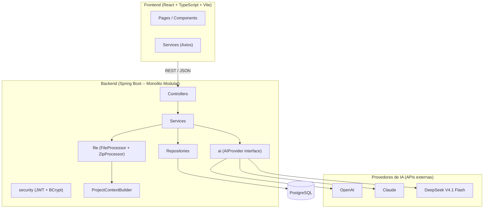
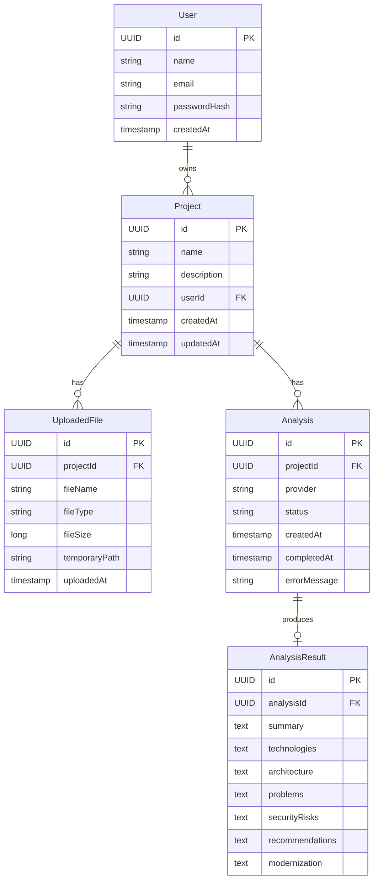
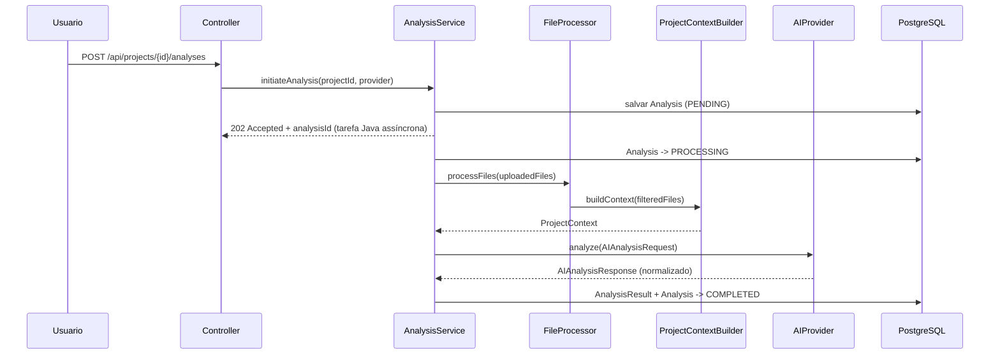

# Arquitetura -- LegacyAI

> Descrição da implementação homologada em `c454191`.
> Para trabalhar em area especifica, parta de `backend/ARCHITECTURE.md` ou `frontend/ARCHITECTURE.md`.

## Visao geral

Monolito modular: backend Spring Boot unico, frontend React separado, comunicacao via REST/JSON,
PostgreSQL como banco de dados. Sem microsservicos, sem mensageria, sem cache externo no MVP.

## Diagrama de componentes

## Modulos do backend

| Modulo      | Responsabilidade                                        |
|-------------|----------------------------------------------------------|
| `security`  | Autenticacao JWT, autorizacao, BCrypt, filtros           |
| `project`   | CRUD de projetos, verificacao de propriedade             |
| `file`      | Validacao, extracao segura de ZIP, filtro de arquivos    |
| `analysis`  | Orquestracao do fluxo, status, persistencia do relatorio |
| `ai`        | Interface `AIProvider` + estrategias por fornecedor      |
| `shared`    | DTOs, excecoes globais, configuracoes comuns             |

## Modelo de dados

**Analysis.status:** `PENDING` → `PROCESSING` → `COMPLETED` ou `FAILED`. Os campos compostos do resultado são persistidos como texto (listas serializadas em JSON).

## Pipeline de analise

## Infraestrutura

- **Docker Compose:** `backend/docker-compose.yml` contém somente PostgreSQL 16; backend e frontend executam localmente.
- **Portas locais:** PostgreSQL `localhost:5433` → contêiner `5432`; backend `8080` por padrão; Vite `5173` por padrão.
- **Uploads:** metadados e caminho em PostgreSQL; bytes armazenados no diretório `upload.temp-dir` (padrão `${user.home}/.legacyai/uploads`). Uma cópia de trabalho para extração/análise é temporária e removida após o processamento; o arquivo enviado permanece disponível para análises posteriores.
- **Processamento:** `CompletableFuture.runAsync` no próprio backend, sem fila/worker externo durável; frontend faz polling do detalhe da análise.
- Detalhes de variaveis de ambiente: `SKILLS.md` -- secao Infraestrutura.

## Seguranca -- visao geral

- Spring Security com filtro JWT stateless.
- BCrypt para hash de senhas.
- Verificacao de propriedade em todos os services.
- Chaves de IA exclusivamente em variaveis de ambiente.

-> Detalhes: `docs/features/authentication.md`
-> Contrato REST completo: `docs/api/contracts.md`
